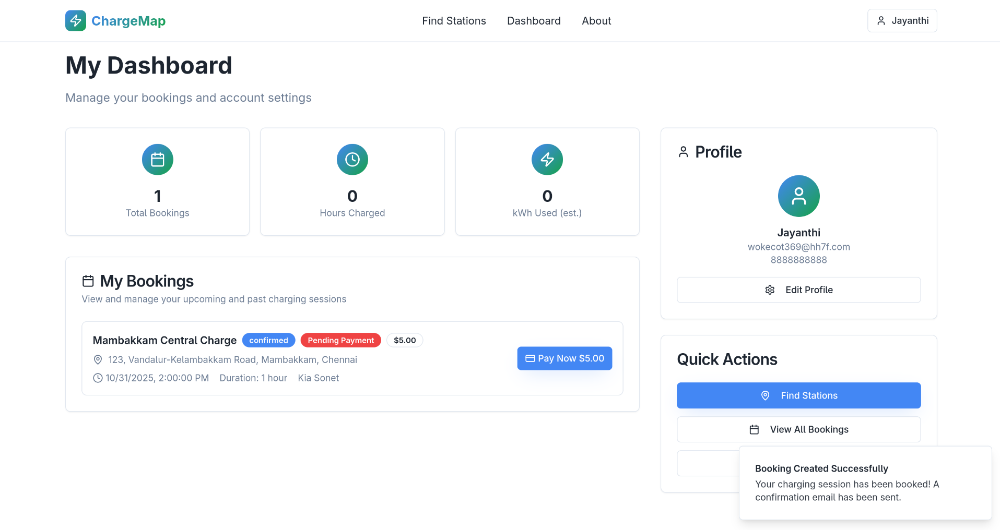
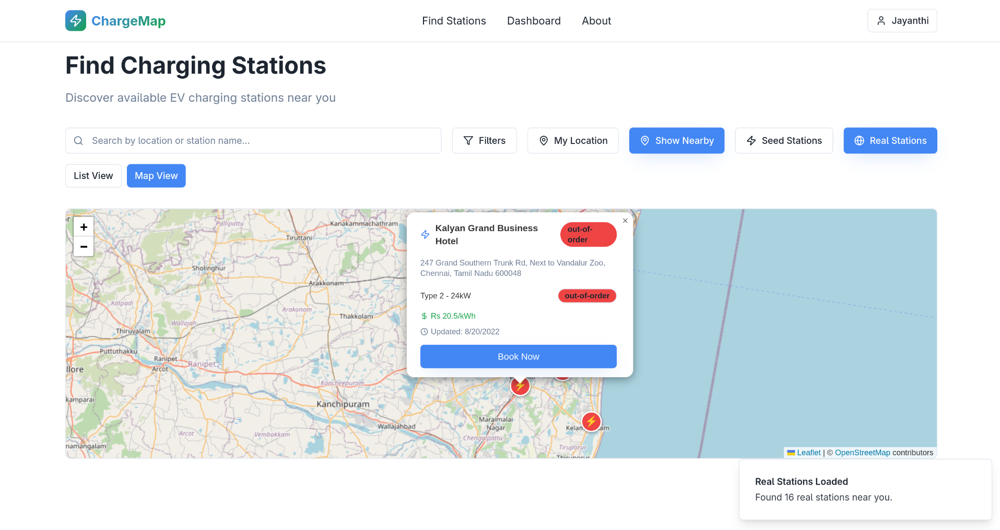

<div align="center">

# eMobility ChargeMap

### Charge Smarter Drive farther

**A modern full-stack platform for finding and booking EV charging stations**

[](https://nodejs.org/)
[](https://reactjs.org/)
[](https://www.typescriptlang.org/)
[](https://www.mongodb.com/)

</div>

---

## Screenshots

<div align="center">

### Landing Page


### Real Station Map


</div>

---

## Features

| Feature | Description |
|---------|-------------|
| 🔍 **Station Discovery** | Find nearby charging stations with real-time availability |
| 🗺️ **Interactive Maps** | OpenStreetMap integration with distance calculations |
| 📅 **Smart Booking** | Advanced time slot selection with conflict prevention |
| 🌐 **Real Station Data** | Integration with Open Charge Map API |
| 👤 **User Dashboard** | Manage bookings, view history, and update profile |
| 💳 **Payment Integration** | Stripe integration for secure payments |
| ⭐ **Reviews & Ratings** | Rate and review charging stations |

---

## Tech Stack

<div align="center">

### Backend


### Frontend


</div>

**Key Technologies:**
- **Backend**: Node.js, Express.js, MongoDB, Mongoose, JWT, Nodemailer
- **Frontend**: React 18, TypeScript, Vite, Tailwind CSS, Shadcn/ui, Leaflet
- **Services**: Stripe (Payments), Open Charge Map API (Real stations)

---

## Quick Start

### Prerequisites

- Node.js 18+ 
- MongoDB 5.0+
- npm or yarn

### Installation

1. **Clone the repository**
   ```bash
   git clone https://github.com/your-org/chargemap.git
   cd chargemap
   ```

2. **Install dependencies**
   ```bash
   # Install backend dependencies
   npm install
   
   # Install frontend dependencies
   cd frontend && npm install && cd ..
   ```

3. **Configure environment**
   ```bash
   # Backend environment
   cp env.example .env.backend
   
   # Frontend environment
   cp frontend/env.example frontend/.env
   ```
   
   **Required environment variables:**
   
   **Backend** (`.env.backend`):
   ```env
   MONGODB_URI=mongodb://localhost:27017/chargemap
   JWT_SECRET=your-secret-key
   EMAIL_USER=your-email@gmail.com
   EMAIL_PASS=your-app-password
   PORT=3000
   ```
   
   **Frontend** (`frontend/.env`):
   ```env
   VITE_API_URL=http://localhost:3000/api
   VITE_STRIPE_PUBLISHABLE_KEY=your-stripe-key
   ```

4. **Start development servers**
   ```bash
   # Terminal 1 - Backend (port 3000)
   npm start
   
   # Terminal 2 - Frontend (port 8080)
   cd frontend && npm run dev
   ```

5. **Access the application**
   - Frontend: http://localhost:8080
   - Backend API: http://localhost:3000

---

## API Endpoints

### Authentication
```
POST /api/auth/register    → Register new user
POST /api/auth/login       → User login
```

### Stations
```
GET  /api/stations                        → List all stations
GET  /api/stations/:id                    → Get station details
POST /api/stations/recommendations        → Get nearby stations
GET  /api/real-stations/by-location        → Get real stations by location
GET  /api/availability/slots              → Get available time slots
```

### Bookings
```
POST   /api/bookings              → Create booking
DELETE /api/bookings/:id          → Cancel booking
POST   /api/bookings/:id/complete → Complete booking
```

### User
```
GET /api/users/me/bookings  → Get user bookings
PUT /api/users/me/profile    → Update profile
```

### Reviews
```
POST /api/reviews  → Submit review
```

---

## Project Structure

```
chargemap/
├── src/                        # Backend source
│   ├── controllers/            # Route handlers
│   ├── models/                 # Database schemas
│   ├── routes/                 # API routes
│   ├── services/               # Business logic
│   ├── middleware/             # Custom middleware
│   ├── config/                 # Configuration
│   └── validation/             # Input validation
│
├── frontend/                   # React application
│   ├── src/
│   │   ├── components/         # UI components
│   │   ├── pages/              # Page components
│   │   ├── services/           # API client
│   │   ├── contexts/           # React contexts
│   │   └── hooks/              # Custom hooks
│   └── public/                 # Static assets
│
└── README.md
```

---

## License

ISC License

---

<div align="center">


[Back to Top](#⚡-emobility-chargemap)

</div>
